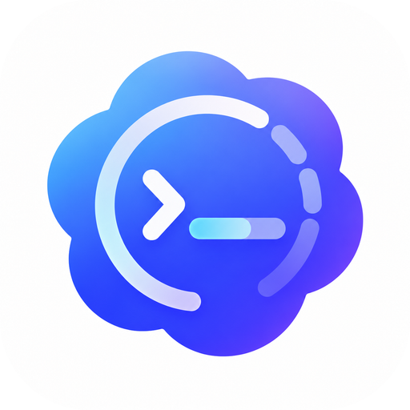
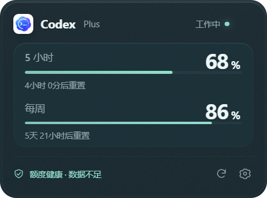
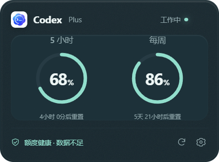
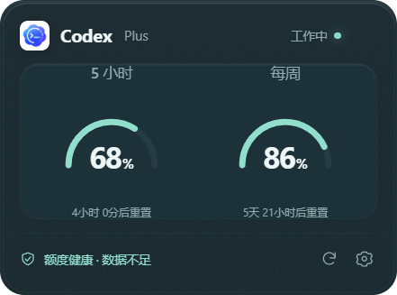
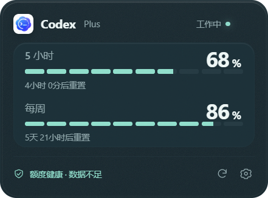
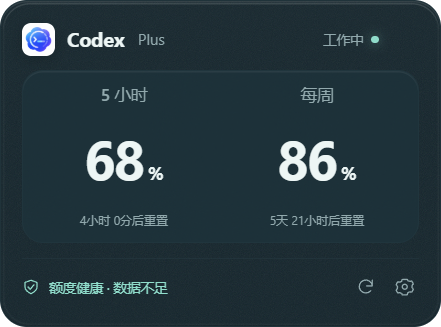

<p align="center"><a href="https://github.com/Chiyang001"></a></p>

<h1 align="center">Codex Monitor</h1>

<p align="center">Codex 额度决策助手 · 看见余量，安排工作</p>

<p align="center"><strong>v1.1.0</strong> · Windows x64 · 单文件便携版 · 开发者：炽阳001</p>

<p align="center"><a href="https://github.com/Chiyang001/CodexMonitor/releases/download/v1.1.0/CodexMonitor-1.1.0-Windows.exe"><strong>下载 EXE</strong></a> · <a href="https://github.com/Chiyang001/CodexMonitor/releases">版本发布</a> · <a href="CHANGELOG.md">更新日志</a> · <a href="https://space.bilibili.com/404891612">B 站主页</a> · <a href="https://github.com/Chiyang001?tab=repositories">GitHub 主页</a></p>

---

**把额度信息放在手边。** Codex Monitor 显示本机已登录 Codex 账号的真实额度、剩余百分比和重置倒计时，还可以根据近期采样提供额度健康度、今日预算与耗尽预测。

## 界面预览

| 进度条 | 环形百分比 | 半圆仪表 |
| :---: | :---: | :---: |
|  |  |  |

<details>
<summary>查看更多仪表盘样式</summary>

| 分段刻度 | 数字卡片 |
| :---: | :---: |
|  |  |

</details>

预览使用演示数据。实际额度与周期以你的账号接口返回为准。

## 快速开始

1. 本机安装 Codex，并登录 ChatGPT 账号。
2. [下载 CodexMonitor-1.1.0-Windows.exe](https://github.com/Chiyang001/CodexMonitor/releases/download/v1.1.0/CodexMonitor-1.1.0-Windows.exe)。
3. 双击 EXE 运行，在悬浮窗或托盘图标上右键打开菜单。

便携版约 **96 MB**，自带 Electron 运行时，无需安装 Node.js。程序未进行代码签名，首次运行可能出现 Windows 提示。任务栏文字功能使用 Windows 自带的 .NET Framework。

程序手动启动，不添加开机自启动。Codex 启动后显示悬浮窗，退出后隐藏并关闭额度连接。再次运行会恢复已有实例。

## 能做什么

| 功能 | 说明 |
| --- | --- |
| 额度监控 | 显示套餐、实际额度周期、剩余百分比、重置倒计时及 Codex 活动状态。 |
| 智能额度 | 提供额度健康度、今日安全预算、耗尽预测和使用建议。 |
| 当前任务 | 查看最近活动任务的时长、模型、Token 增量与观测期间额度变化。 |
| 通知提醒 | 分别设置重置前 30 分钟、重置确认、低额度与周消耗偏快提醒。 |
| 历史统计 | 查看未来 24 小时额度时间轴和最近 24 小时采样曲线。 |
| 任务栏文字 | 在任务栏直接显示 5h 和每周剩余额度，支持字号、布局及位置调整。 |

## 按你的习惯设置

所有设置即时生效并自动保存，主题与仪表盘样式独立选择。

| 设置入口 | 可调整内容 |
| --- | --- |
| 界面主题 | 十套配色，悬浮窗、菜单与面板同步切换。 |
| 仪表盘样式 | 进度条、环形百分比、半圆仪表、分段刻度、数字卡片。 |
| 界面效果 | 半透明效果默认关闭，开启后使用磨砂毛玻璃。 |
| 窗口大小 | 85%、100%、125%、150%、200% 预设，也可拖动右下角调整。 |
| 显示位置 | 开启任务栏额度文字，选择一行或两行，调整字号、左侧留白及文字颜色。 |
| 关于 | 版本、开发者 Logo 与主页链接，以及检查更新入口。 |

**十套主题：** 深海薄荷、晴空纸白、星夜紫、暖砂金、极夜冰蓝、暮色玫瑰、石墨银灰、晨雾鼠尾草、奶油蜜桃、轻柔薰衣草。

### 任务栏文字

在 **设置 → 显示位置** 开启“在任务栏显示额度文字”。支持主屏幕水平任务栏，任务栏文字独立于悬浮窗。

- **布局：** 默认两行，也可选择一行并排显示。
- **字号：** 10–24 像素，默认 12。两行布局高度不足时缩小显示字号以避免裁切，保留用户设置。
- **位置：** 默认左侧留白 340 逻辑像素，可调整以避开 Traffic Monitor、天气及应用图标。
- **交互：** 右键文字打开菜单，双击打开设置。深色任务栏开关控制文字颜色。

### 常用操作

| 操作 | 效果 |
| --- | --- |
| 拖动标题或额度区域 | 移动悬浮窗。 |
| 点击右上角 × | 暂时隐藏悬浮窗。 |
| 点击托盘图标 | 恢复悬浮窗。 |
| 点击额度健康度 | 打开智能额度面板。 |
| 右键悬浮窗或托盘 | 打开快捷菜单。 |
| 按 Esc | 关闭当前面板。 |

## 数据与隐私

通过官方本机 `codex app-server` 读取额度，不发起模型请求。不保存账号明文、令牌、提示词或对话内容，历史数据仅保存在本机。

设置保存在 `%LOCALAPPDATA%\CodexMonitor\settings.json`。数值历史按账号标识哈希隔离，最多保留八天。1.1.0 兼容旧版设置与 C# 历史格式。

> 预算与耗尽预测基于近期观测速率，不保证任务一定完成。历史不足、数据过期、额度修正或等待重置确认时会暂停相应预测。任务额度变化可能包含其他客户端或并发任务的消耗。

<details>
<summary>查看额度来源与兼容性说明</summary>

- 使用 `initialize`、`account/read`、`account/rateLimits/read` 接口，优先读取 `rateLimitsByLimitId.codex`，没有分组字段时读取 `rateLimits`。
- 按 `windowDurationMins` 识别实际周期，剩余额度为 `100 - usedPercent`。缺失额度不会显示为无限或 100%。
- 自动发现 Codex CLI，也支持 PATH、`CODEX_MONITOR_CODEX_PATH` 和 `CODEX_HOME`。认证文件变更后清除旧快照并重新连接。
- API Key 登录可能没有对应的 ChatGPT 套餐额度。接口没有账号标识时按认证文件修改标记隔离采样，刷新认证可能需要重新积累历史。
- 预测至少需要 15 分钟同周期采样，数据超过 75 秒未更新时暂停预测。重置必须经官方接口确认，不假定已经恢复。
- 同周期同类通知在本次运行期间只发送一次，Windows 通知设置可能影响显示。

</details>

## 开发与构建

需要 Node.js 22 或更新版本。

```powershell
npm ci
npm start
```

| 命令 | 用途 |
| --- | --- |
| `npm test` | 核心逻辑、迁移、RPC 与任务栏数据检查。 |
| `npm run test:ui` | 实际 Electron 窗口中的主题、设置、任务栏文字及链接检查。 |
| `npm run pack` | 生成或更新 `dist/electron/win-unpacked`。 |
| `npm run dist` | 生成 Windows 单文件便携 EXE。 |
| `.\build.ps1` | 运行测试并打包发布版本。 |

界面检查使用演示数据，预览输出到 `artifacts`，不修改正式用户偏好。原 C# 实现归档在 `legacy/native`，不参与当前构建。

<details>
<summary>目录安装与卸载</summary>

开发构建后可运行 `Install.cmd`，将完整程序安装到 `%LOCALAPPDATA%\CodexMonitor\app`，并创建桌面和开始菜单快捷方式。安装不添加开机自启动，也不会自动运行程序。

先从菜单退出，再运行 `%LOCALAPPDATA%\CodexMonitor\Uninstall.ps1` 卸载。设置与数值历史保留，需要清除历史时可在退出后删除 `usage-*.json`。

</details>

---

<p align="center">开发者 <strong>炽阳001</strong> · <a href="https://space.bilibili.com/404891612">B 站</a> · <a href="https://github.com/Chiyang001?tab=repositories">GitHub</a> · <a href="https://github.com/Chiyang001/CodexMonitor/issues">反馈问题</a></p>
